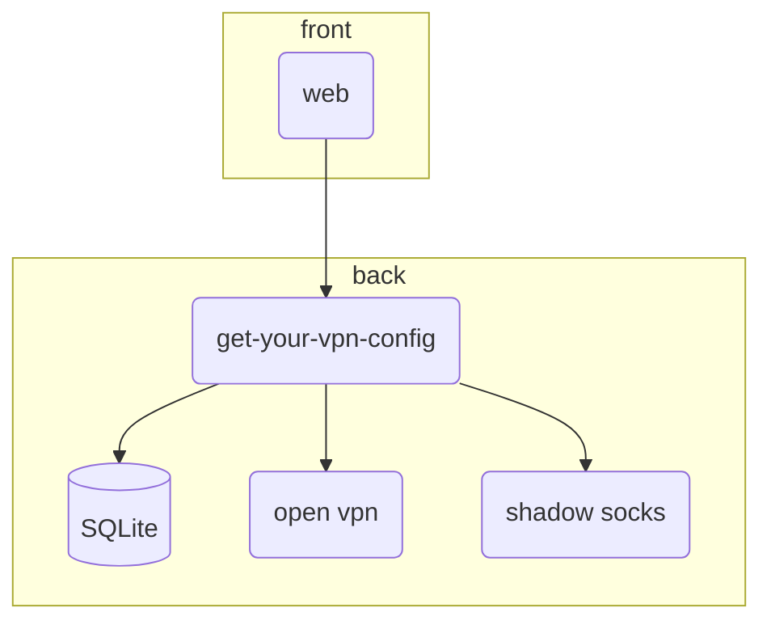
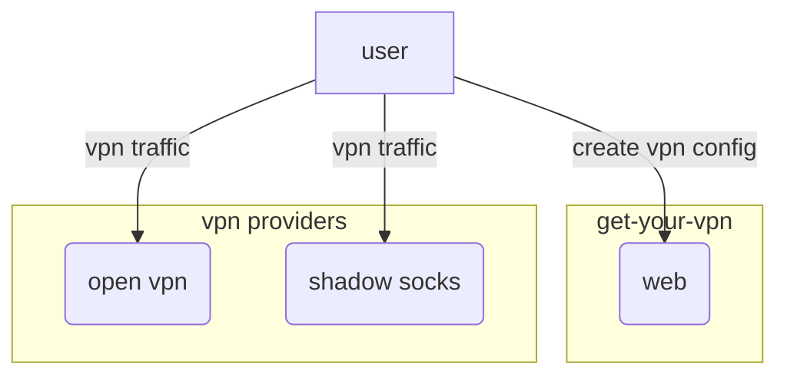
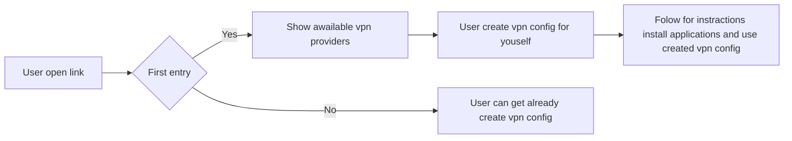

# Видение проекта

## Что это?
Доступ к информации в РФ становится все сложнее, доступность информации, какого бы качества она не была, падает. 
Этот проект призван повышать доступность путем развертывания набора сервисов по обходу блокировок на небольшом сервере руками энтузиаста (мейнтейнер).
Мейнтейнер сервера имеет возможность генерировать ссылку приглашение на web сайт (быть может бота) с инструкциями и настройками для обхода блокировок.
Подразумевается, что мейнтейнер раздает доступы только знакомым и проверенным людям, круг людей с инвайт ссылками ограничен и не большой. 
Большое кол-во пользователей сервиса может нагружать его, тратить трафик, тем самым повышая денежные ресурсы на поддержку.
Идея - много маленьких независимых мейнтейнеров, с небольшими серверами, чем один большой, чья блокировка может плохо сказаться на доступности информации.

## Как работает?

Грубо говоря проект можно разделить на две части - пользовательский фронт и серверная составляющая (набор сервисов).
Желательно хостить фронт отдельно от сервера. 
Пользователь, обладатель ссылки, имеет доступ только к функционалу просмотра своих конфигураций для различных сервисов по обходу блокировок.
Мейнтейнер может генерировать, удалять, просматривать список инвайт ссылок (на данном эпате фронт под это не планируется)

### Схема сервиса

### Схема взаимодействия пользователя

## Требования к фронту пользователя
Простота - конечным потребителем может быть далекий от программирования и не быть продвинутым пользователем.
По инвайт ссылке появляется набор средств для обхода блокировок, например можно сгенерировать ovpn файл или shadow socks ссылку для прокси.
По умолчанию у пользователя будет доступны все провайдеры для обхода блокировок.
Для понимания как это запустить необходимо привязать небольшую инструкцию и ссылку на установку софта.

## Пользовательский путь

